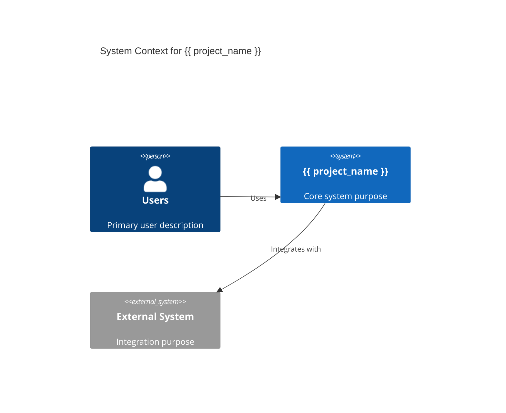
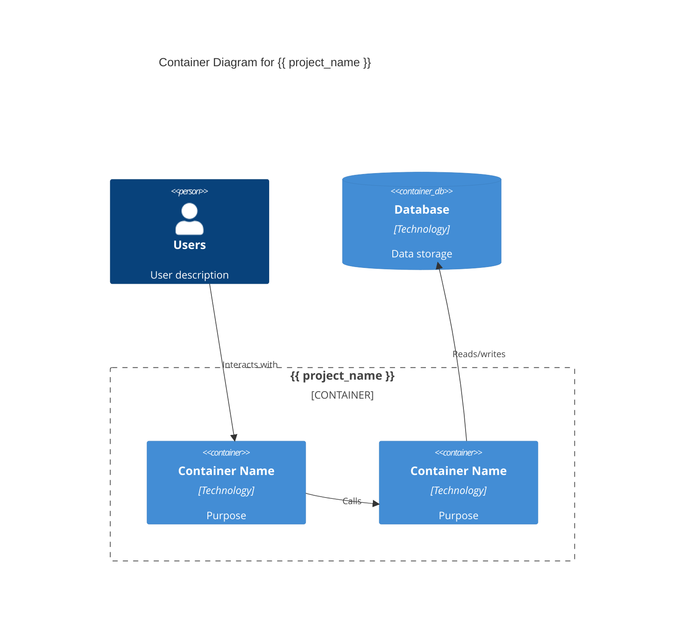
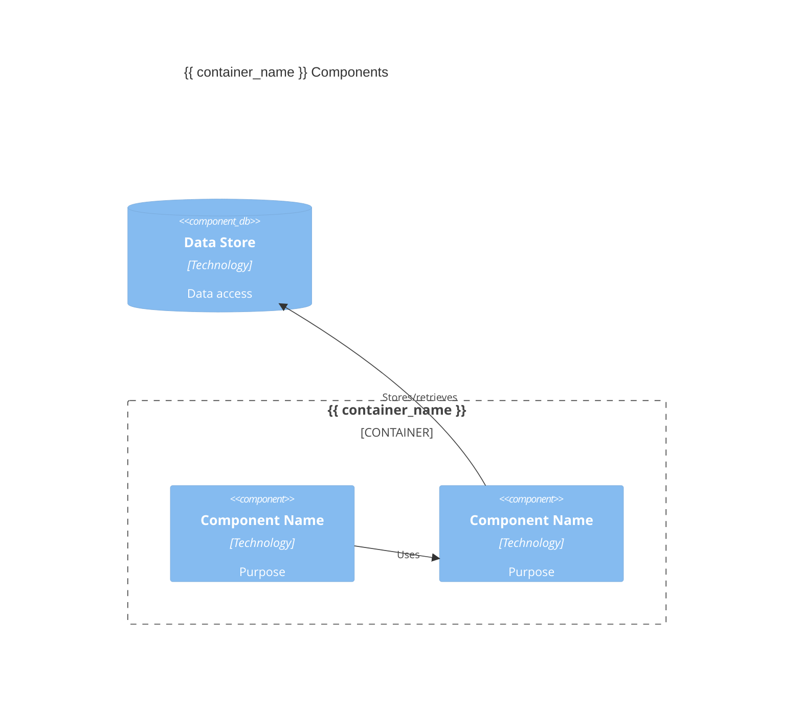

# TemporalBridge Architecture Bootstrap

Initialize complete architecture documentation for this project by analyzing the entire codebase and generating comprehensive C4 architecture documents, ADRs, and bootstrapping the knowledge graph.

## Primary Responsibility

**Architecture Bootstrap & Discovery**
- Analyze entire codebase structure to discover architectural patterns
- Generate initial C4 architecture documentation (Context, Container, Component, Code levels)
- Create foundational Architecture Decision Records (ADRs) based on technology choices
- Set up complete documentation folder structure and templates
- Bootstrap knowledge graph with discovered architectural entities and relationships

**First-Time Project Setup**
- Handle projects with zero existing architectural documentation
- Perform comprehensive codebase analysis (not just git diff analysis)
- Create documentation templates tailored to discovered architectural patterns
- Establish baseline for ongoing architectural change monitoring

## Bootstrap Process Workflow

**SCOPE LIMITATION**: Bootstrap generates C4 Levels 1-3 only. Do NOT create Level 4 (Code) documentation.

### **Phase 1: Project Discovery**
```markdown
1. Analyze project structure and technology stack
2. Identify architectural patterns and component relationships
3. Discover services, databases, APIs, and external dependencies
4. Map technology choices and framework usage
5. Assess project scale and complexity
```

### **Phase 2: Documentation Generation**
```markdown
1. Create docs/architecture/ and docs/adr/ folder structures
2. Generate summary documents using consistent naming:
  - c4-level1-context.md (system overview)
  - c4-level2-container.md (all containers in this system)
  - c4-level3-{container-name}.md (components per container)
3. Create initial ADRs documenting major technology and architectural decisions

IMPORTANT: Bootstrap generates ONLY summary documents. Detailed expansions are created manually when needed.
Do NOT generate C4 Level 4 (Code) documentation during bootstrap.
```

### **Phase 3: Knowledge Graph Bootstrap**
```markdown
1. Ingest all generated documentation into TemporalBridge knowledge graph using `mcp__temporal-bridge__ingest_documentation` tool
```

## Documentation Generation

Create comprehensive documentation following TemporalBridge entity schema requirements:

### **Entity Schema Compliance**

**Architecture Entities:**
```yaml
---
entity_type: Architecture
component_type: service | database | api | library | frontend | backend | infrastructure
c4_layer: context | container | component | code
status: active | deprecated | planned | experimental | legacy
---
```

**ADR Entities:**
```yaml
---
entity_type: ArchitectureDecision
decision_title: "Brief description of decision"
status: proposed | accepted | deprecated | superseded
decision_date: "YYYY-MM-DD" 
impact_scope: system-wide | service-specific | data-layer | ui-layer | integration
alternatives_considered: "List of alternatives evaluated"
---
```

**DataModel Entities:**
```yaml
---
entity_type: DataModel
model_type: entity | aggregate | dto | event | schema | interface
storage_layer: postgres | redis | zep | memory | file | api
schema_format: typescript | json-schema | sql | graphql | protobuf
---
```

**Key Guidelines:**
- **component_type**: `service` (APIs, microservices), `database` (data stores), `frontend` (UIs), `backend` (servers), `infrastructure` (deployment), `api` (REST/GraphQL), `library` (shared code)
- **c4_layer**: Maps to C4 levels - `context` (L1), `container` (L2), `component` (L3), `code` (L4)
- **status**: `active` (current), `deprecated` (phasing out), `planned` (designed), `experimental` (prototype), `legacy` (old)

### **Summary Documentation Structure**

**Generated Documents (Bootstrap Creates These Only):**
- `docs/architecture/`
  - `c4-level1-context.md` - System context overview
  - `c4-level2-container.md` - All containers in this system
  - `c4-level3-{container-name}.md` - Components per container
- `docs/adr/` - Architecture Decision Records

**Naming Convention:**
```
c4-level{N}[-{container-name}].md
```

**Bootstrap Examples:**
- `c4-level1-context.md` - System context and external dependencies
- `c4-level2-container.md` - All containers in the system
- `c4-level3-frontend.md` - Frontend container components
- `c4-level3-api.md` - API container components
- `c4-level3-database.md` - Database container components

**Manual Expansion (Created Later When Needed):**
- `c4-level1-context-payment-gateway.md` - Payment system deep dive
- `c4-level2-frontend.md` - Detailed frontend container breakdown
- `c4-level3-frontend-ui-components.md` - UI component group focus

**Integration Requirements:**
- Proper YAML frontmatter for Zep knowledge graph ingestion
- **Mermaid diagrams** in all summary documents
- **Consistent hierarchical naming** for future expansion compatibility


## Documentation Templates

### **C4 Level 1 Context Template**
```markdown
---
entity_type: Architecture
component_type: infrastructure
c4_layer: context
technology_stack: {{ detected_tech_stack }}
status: active
document_purpose: System context and external dependencies
external_systems: {{ discovered_external_systems }}
stakeholders: {{ identified_stakeholders }}
---

# {{ project_name }} System Context

## System Purpose
Brief 1-2 sentence description of what this system does and its primary business value.

## Key External Systems
List 3-5 major external systems this system interacts with:
- **System Name** - Brief interaction description
- **System Name** - Brief interaction description

## System Boundaries
### **What This System Does**
- 3-4 bullet points of core responsibilities
- Keep each point to one line

### **What This System Does NOT Do** 
- 2-3 bullet points of explicit non-responsibilities
- Dependencies handled by external systems

## Context Diagram

```

### **C4 Level 2 Container Template**
```markdown
---
entity_type: Architecture
component_type: system
c4_layer: container
technology_stack: {{ detected_tech_stack }}
status: active
document_purpose: Container architecture and internal components
containers: {{ major_containers }}
---

# {{ project_name }} Container Architecture

## Container Overview
Brief 1-2 sentence description of the overall container architecture approach.

## Primary Containers
List 3-6 major containers in the system:

### **{{ Container_Name }}**
- **Technology**: Primary technology stack
- **Purpose**: Single line description of responsibility
- **Key Functions**: 2-3 bullet points of main capabilities

### **{{ Container_Name }}**
- **Technology**: Primary technology stack  
- **Purpose**: Single line description of responsibility
- **Key Functions**: 2-3 bullet points of main capabilities

## Container Diagram

```

### **C4 Level 3 Component Template (Summary)**
```markdown
---
entity_type: Architecture
component_type: {{ container_type }}
c4_layer: component
technology_stack: {{ detected_tech_stack }}
status: active
document_purpose: Component summary for {{ container_name }} container
---

# {{ container_name }} Container Components

## Component Overview
Brief 1-2 sentence description of this container's component architecture.

## Architectural Components (4-8 major components)
List major architectural components (NOT individual classes/files):

### **{{ Component_Name }}**
- **Responsibility**: Single line description
- **Technology**: Implementation technology
- **Interfaces**: What it provides to other components

### **{{ Component_Name }}**
- **Responsibility**: Single line description
- **Technology**: Implementation technology  
- **Interfaces**: What it provides to other components

## Component Diagram


## Component Interactions
Brief 2-3 sentence description of how components work together.
```

### **ADR Template for Technology Decisions**
```markdown
---
entity_type: ArchitectureDecision
decision_title: "{{ technology_choice }} Selection"
status: accepted
decision_date: {{ current_date }}
impact_scope: system-wide
technology_stack: {{ specific_technologies }}
decision_topic: technology_selection
---

# ADR-{{ number }}: {{ technology_choice }} Selection

## Status
**Accepted** - {{ date }}

## Context
Brief 1-2 sentence description of why this technology decision was needed.

## Decision
We will use {{ technology_choice }} for {{ use_case }}.

## Rationale
List 2-4 key reasons for this choice:
- **Reason 1**: Brief explanation
- **Reason 2**: Brief explanation
- **Reason 3**: Brief explanation

## Consequences
### Positive
- 2-3 benefits of this decision

### Trade-offs
- 1-2 limitations or costs accepted

## Review Criteria
This decision should be reviewed if {{ review_conditions }}.
```

## C4 Level Guidance by Project Type

### **Frontend/Web Applications**
- **Level 1 (Context)**: External users, browsers, CDNs, analytics services
- **Level 2 (Container)**: Web app, API services, databases, external integrations
- **Level 3 (Component)**: Architectural systems (routing engine, state management, rendering pipeline, styling system)
  - ❌ **Avoid**: Individual UI components (Button, Modal, Card components)
  - ✅ **Focus**: System-level building blocks and their interactions
  - ⚠️ **STOP HERE**: Do not create Level 4 documentation during bootstrap

### **Backend/API Applications**
- **Level 1 (Context)**: Client applications, external services, data sources
- **Level 2 (Container)**: API server, databases, message queues, caching layers
- **Level 3 (Component)**: Service layers (controllers, business logic, data access, authentication)
  - ❌ **Avoid**: Individual classes, functions, or data models
  - ✅ **Focus**: Logical service boundaries and responsibilities

### **Microservices/Distributed Systems**
- **Level 1 (Context)**: Users, external systems, service boundaries
- **Level 2 (Container)**: Individual microservices, databases, message brokers
- **Level 3 (Component)**: Internal service components (message handlers, processors, adapters, gateways)
  - ❌ **Avoid**: Implementation details or individual endpoints
  - ✅ **Focus**: Major functional areas within each service

### **CLI/Desktop Applications**
- **Level 1 (Context)**: Users, file system, external tools, networks
- **Level 2 (Container)**: Main application, configuration, data storage
- **Level 3 (Component)**: Core subsystems (command processor, plugin system, data manager)
  - ❌ **Avoid**: Individual commands or utility functions
  - ✅ **Focus**: Major architectural subsystems and their roles

## C4 Level 4 (Code) - Not Included in Bootstrap

**Level 4 focuses on code-level implementation details** and is typically not generated during bootstrap as it requires deep code analysis:

### **What Level 4 Contains:**
- **Individual Classes and Interfaces** - Specific class diagrams with methods and properties
- **Implementation Details** - Code-level patterns, algorithms, data structures
- **Detailed Relationships** - Inheritance, composition, dependency injection patterns
- **Code Organization** - Package structures, namespaces, module dependencies

### **Examples by Project Type:**
- **Frontend**: Individual React components (Button, Modal), custom hooks, utility functions
- **Backend**: Specific controller classes, service implementations, data access objects
- **CLI**: Command classes, argument parsers, individual utility functions

### **When to Create Level 4 Documentation:**
- **Complex architectural patterns** need code-level explanation
- **Team onboarding** requires understanding of key implementation details
- **API design** documentation for library or framework development
- **Legacy system** documentation where code is the primary documentation source

**Note**: Level 4 is created manually when needed, not during automated bootstrap processes.

## Success Criteria

- [ ] **Summary documents generated**: `c4-level1-context.md`, `c4-level2-container.md`, `c4-level3-{container}.md`
- [ ] **Hierarchical naming convention** followed for all generated summary documents
- [ ] `docs/adr/` created with technology decision records using templates above
- [ ] All documentation has valid YAML frontmatter matching entity schemas
- [ ] C4 levels follow appropriate abstraction guidance for project type
- [ ] **CRITICAL**: No C4 Level 4 (Code) documentation generated during bootstrap
- [ ] **CRITICAL**: No expansion documents generated - summaries only
- [ ] Knowledge graph successfully ingested all summary documentation
- [ ] Architecture search queries return relevant results
- [ ] Major services/components summarized at appropriate abstraction levels

Begin the analysis and bootstrap process by following the steps above systematically.