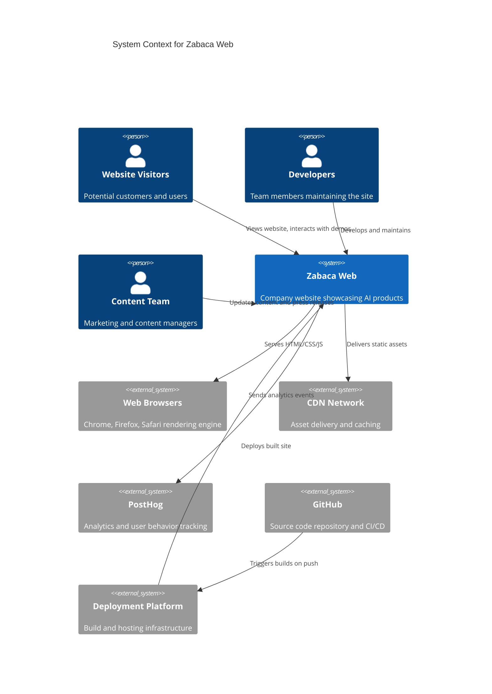

# Zabaca Web System Context

## System Purpose
Modern company website showcasing Zabaca's AI-powered product suite with interactive components and optimized user experience.

## Key External Systems
List of major external systems this system interacts with:
- **Web Browsers** - Client-side rendering and interaction platform
- **CDNs** - Static asset delivery and caching infrastructure  
- **PostHog Analytics** - User behavior tracking and analytics
- **GitHub** - Source code repository and CI/CD triggers
- **Deployment Platform** - Automated build and deployment pipeline

## System Boundaries
### **What This System Does**
- Renders responsive company website with product information
- Provides interactive product demos and examples
- Collects user analytics and engagement metrics
- Serves static content with optimized performance

### **What This System Does NOT Do** 
- User authentication or account management
- Backend data processing or API services
- Product functionality implementation
- Payment processing or e-commerce features

## Context Diagram
