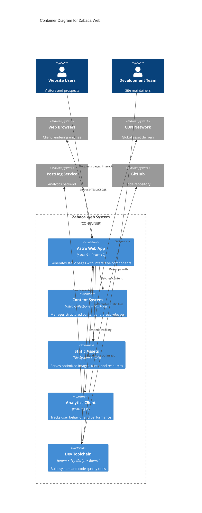

# Zabaca Web Container Architecture

## Container Overview
Monorepo architecture built around Astro static site generator with React components and modern toolchain for optimal performance.

## Primary Containers

### **Astro Web Application**
- **Technology**: Astro 5.x with React 19 integration
- **Purpose**: Main application container handling SSG, routing, and page rendering
- **Key Functions**: Page generation, component hydration, build optimization, development server

### **Static Assets Container**
- **Technology**: File system with CDN integration
- **Purpose**: Serves images, icons, fonts, and other static resources
- **Key Functions**: Asset optimization, caching headers, responsive image delivery

### **Content Management System**
- **Technology**: Astro Content Collections with Markdown
- **Purpose**: Manages press releases and structured content
- **Key Functions**: Content validation, schema enforcement, static content generation

### **Analytics Integration**
- **Technology**: PostHog JavaScript client
- **Purpose**: User behavior tracking and performance monitoring
- **Key Functions**: Event tracking, session recording, performance metrics

### **Development Toolchain**
- **Technology**: pnpm workspace, TypeScript, Biome
- **Purpose**: Build system, code quality, and development workflow
- **Key Functions**: Dependency management, linting, formatting, type checking

## Container Diagram
