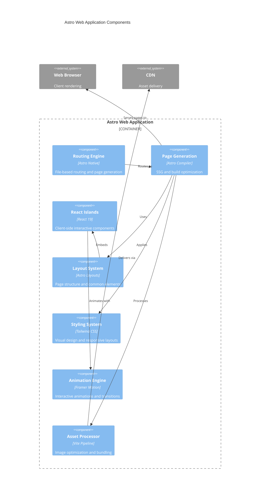

# Astro Web Application Container Components

## Component Overview
Astro-based static site generator with React component islands and modern styling systems for optimal performance and user experience.

## Architectural Components (Major functional areas)

### **Routing Engine**
- **Responsibility**: File-based routing and page generation
- **Technology**: Astro native routing with TypeScript
- **Interfaces**: Handles URL patterns, dynamic routes, and static generation

### **Page Generation System**
- **Responsibility**: Server-side rendering and static site generation
- **Technology**: Astro compiler with build optimization
- **Interfaces**: Transforms Astro files to HTML, manages component hydration

### **React Component Islands**
- **Responsibility**: Interactive client-side functionality
- **Technology**: React 19 with selective hydration
- **Interfaces**: Provides component wrappers, client-side interactivity

### **Layout Management**
- **Responsibility**: Page structure and common UI elements
- **Technology**: Astro layout components with slot system
- **Interfaces**: Shared layouts, nested layouts, slot-based content injection

### **Styling System**
- **Responsibility**: Visual design and responsive layouts
- **Technology**: Tailwind CSS with custom configuration
- **Interfaces**: Component styling, responsive breakpoints, design tokens

### **Animation Engine**
- **Responsibility**: Interactive animations and transitions
- **Technology**: Framer Motion with React integration
- **Interfaces**: Component animations, page transitions, gesture handling

### **Asset Processing**
- **Responsibility**: Image optimization and static asset handling
- **Technology**: Astro asset pipeline with Vite
- **Interfaces**: Image transformations, asset bundling, cache optimization

## Component Diagram

## Component Interactions
The routing engine determines page structure, which the page generation system renders using layouts and React islands. The styling system provides visual consistency while the animation engine adds interactive polish, with asset processing ensuring optimal delivery.