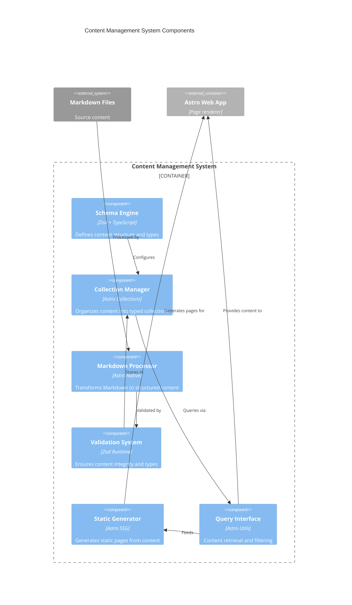

# Content Management System Container Components

## Component Overview
Astro Content Collections-based system providing type-safe content management with schema validation and static generation.

## Architectural Components (Major functional areas)

### **Content Schema Engine**
- **Responsibility**: Defines and validates content structure
- **Technology**: Zod schema validation with TypeScript
- **Interfaces**: Schema definitions, type generation, validation rules

### **Collection Manager**
- **Responsibility**: Organizes content into typed collections
- **Technology**: Astro Content Collections API
- **Interfaces**: Collection configuration, content queries, filtering

### **Markdown Processor**
- **Responsibility**: Transforms Markdown files to structured content
- **Technology**: Astro native Markdown processing
- **Interfaces**: Frontmatter parsing, content transformation, metadata extraction

### **Content Validation System**
- **Responsibility**: Ensures content integrity and type safety
- **Technology**: Zod runtime validation
- **Interfaces**: Build-time validation, error reporting, type enforcement

### **Static Generation Engine**
- **Responsibility**: Generates static pages from content
- **Technology**: Astro static generation with dynamic routes
- **Interfaces**: Page generation, URL patterns, content rendering

### **Content Query Interface**
- **Responsibility**: Provides API for content retrieval
- **Technology**: Astro content utilities
- **Interfaces**: Content filtering, sorting, pagination, metadata access

## Component Diagram

## Component Interactions
Schema engine defines content structure, which collection manager uses to organize Markdown files processed and validated by the system. Query interface retrieves content for static generation and runtime access by the Astro application.